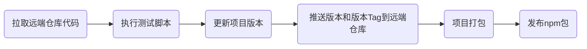
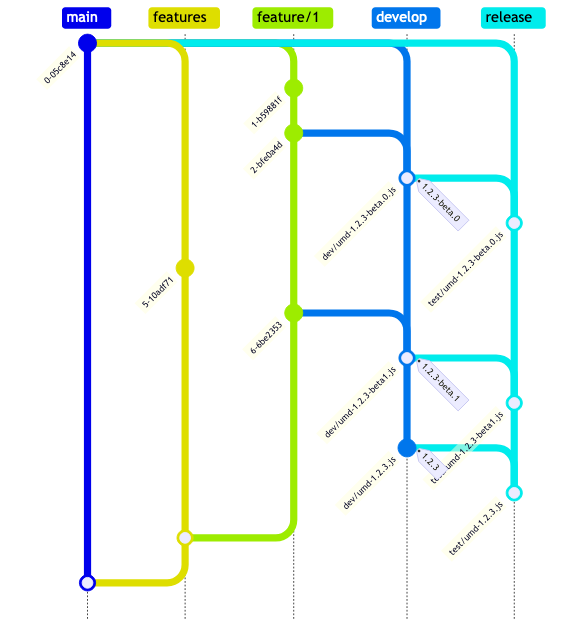

<div align="center">
<h1>前端业务组件库</h1>

[文档 地址](http://dev.secp.business.cp.192.168.221.92.nip.io/docs/intro)

创建业务通用型`web`组件，使用`demo`和文档
</div>

## 开发指南
```shell
# 安装依赖
yarn install
# 本地开发
yarn start
# 生成文档，使用`docusaurus`创建文档
yarn build:doc
```

## 发布版本

### 发布npm包

理论上可以在任何分支发布`npm`包，但是我们仍然建议在`develop`分支上发布

方法一：

安装`shell`工具集合，安装方法查看[这里](http://192.168.226.157:9090/secp/frontend/shell/blob/main/README.md#安装)

安装完成之后，使用如下命令进行`npm`包发布:
```shell
# gp is short for goodwe publish
gp
```
该命令执行如下流程：




方法二：

```shell
yarn pub
```
功能和`gp`一致


### 发布umd包和文档网站

合并代码至`develop`,`release`分支分别进行开发环境和测试环境的发布。

如果安装了`shell`工具集合，可以使用如下命令：
```shell
# gj is short for goodwe jenkins

# 发布开发环境jenkins
gj dev-frontend-web-business-components
# 发布测试环境jenkins
gj test-frontend-web-business-components
```
未安装需要手动点击`jenkins job`

#### 发布secp-base基座
`jenkins`发布完成之后，更新`secp-base`基座中对应库版本

## 如何贡献

### 分支管理策略（暂行）


开发者从`features`分支切出要开发功能分支，完成开发之后合并到`develop`,
再合并到`release`，并发布`npm`包和`umd`包，等待测试。

全部测试完成之后发布正式版本，此次功能如需发布线上，
则合并到`features`分支等待发布，使用`squash commit`方式合并。


<span style="color: red; font-weight: bold;">
此模式会导致线上发布的功能可能少于测试和开发环境的功能。
</span>


## 打包新增的目录结构
```html
dist目录结构
|--dist
  |--es // ESmodule格式文件，方便webpack tree-shaking
  |--lib // CommonJs格式文件，方便项目按需引入
  |--umd // 整体全量js css文件
    |--[package.name]-[package.version].min.css
    |--[package.name]-[package.version].min.js
  |--package.json
```

### 项目文档结构
```html
|--build // yarn build:doc 生成文件夹
|--demos // 放置复杂用例
|--dist // yarn build 生成文件夹
|--docs // 文档
|--packages // 组件库
|--src // 文档使用的组件，页面
|--static // 文档使用静态资源
|--types
|--docusaurus.config.js // docusaurus配置文件
|--sidebars.js // 文档侧边栏设置
|--tsconfig.json
```
