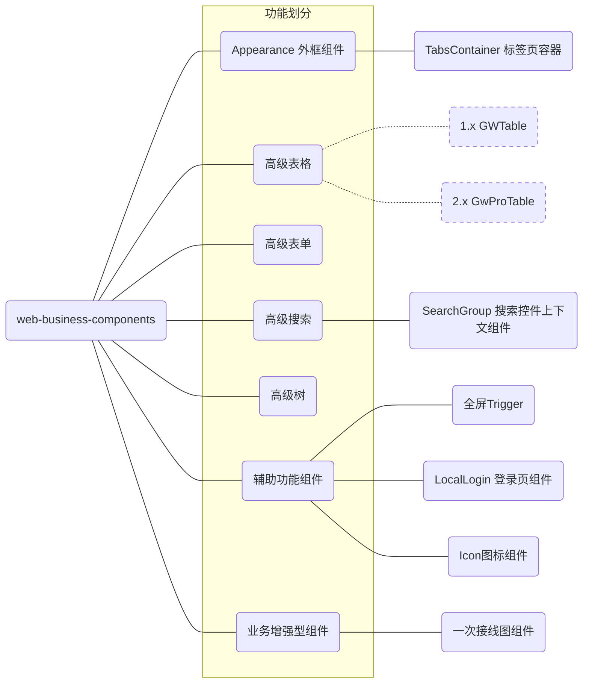

## 组件范围



## 相关技术

- docusarus
- react
- typescript
- less
- antd

## 文件结构

组件源码应都在 packages 目录中，packages 目录结构如下：

```txt
├── packages
│   ├── ...
│   ├── sample
│   │   ├── assets // 组件资源文件
│   │   │   ├── icon-down.svg
│   │   │   └── icon-up.svg
│   │   ├── index.tsx // 组件
│   │   └── style // 样式文件
│   │       ├── index.less
│   │       └── sample.less
│   ├── ...
│   ├── style // 公共样式和less变量
│   │   ├── common.less
│   │   └── variables.less
│   ├── ...
│   ├── index.ts // 组件在此处统一导出
```

## Demo 展示

所有的 demo 都应该写在 demos 文件夹中, Demo 文档目录结构如下：

```txt
├── demos
│   ├── ...
│   ├── sample // demo文件夹
│   │   └── index.tsx
│   ├── ...
│   ├── index.tsx // demo文件统一在此导出
```

## 文档编写

所有的组件都应该有对应的文档

文档编写应包含以下内容：

- 组件说明
- UI 展示
- Demo 代码
- 组件 Api 说明，如果和 antd 一致可以链接 antd 文档地址
- 自动化测试属性说明

文档目录结构如下：

```txt
├── docs
│   ├── ...
│   ├── sample.mdx // 展示demo
│   ├── ...
```

## 样式

- px 尺寸使用 rem 为单位，设计稿 1rem=16px 进行转换
- 颜色、尺寸、字号等有规则的样式应都在 packages/style/variables.less 定义，然后再引入使用
- 公共样式应都在 packages/style/common.less 定义，然后再引入使用

## 约定

- 基础组件库的样式原则上在业务方使用的时候无需修改覆盖，如有样式修改，只可在组件库层面升级维护（除个别组件确需动态改变样式，如 Banner + 用户 + 菜单导航组件）
- antd 已有功能属性 props 沿用 antd 的，只会根据需要添加 antd 没有的功能属性
- 在组件库层级暴露所有 antd 可暴露的类型定义，供业务方使用
- 组件在展示文本时原则上使用外部输入数据，如遇业务组件自己获取数据进行展示，需考虑国际化场景

## 测试

- 在基础组件中测试

  通过编写 demo 可以进行基础组件测试

- 在业务中测试

  由于业务中是通过 npm 包引入基础组件，我们可以发布测试版本的包，然后在业务中更新，或者通过 npm link 在业务中 link 到基础组件项目，具体操作如下：

  ```shell
  # 打开web-basic-components
  cd /path/to/web-basic-components
  # 先build一下项目，生成打包文件
  yarn build
  # npm创建一个symlink在全局中
  npm link

  # 打开web-business-components
  cd /path/to/web-business-components
  # 先build一下项目，生成打包文件
  yarn build
  # npm创建一个symlink在全局中
  npm link

  # 打开项目
  cd /path/to/secp-admin
  # 创建@gw/web-basic-components link到项目node_modules
  npm link "@gw/web-basic-components"
  # 创建@gw/web-business-components link到项目node_modules
  npm link "@gw/web-business-components"

  ```

## Git 规范

- 创建 feature 分支进行开发，feature 分支名为`feature/xxx`
- 一个 feature 开发完毕需要合并到 develop 分支时：
  - 1. 首先在本地将改动提交`git add .`和`git commit -m xxx`
  - 2. 执行`git fetch origin`,从远程拉取当前项目的最新改动
  - 2. 执行`git merge --no-ff origin/develop`合并远程 develop 分支代码,此时，如有冲突解决冲突，解决完毕后再提交到 feature 分支
  - 3. 在 gitlab 界面发送 merge request 给做 code review 的同事
  - 4. code review 审核通过 merge 代码

## 待解决问题

- type 的暴露（包括在`antd/lib/**`层级暴露出的类型）
- 本地 link 调试的问题
